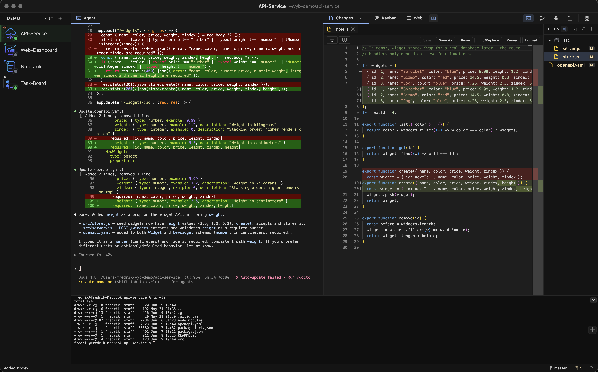

  

<h1 align="center">Vyb</h1>

  An Agentic Development Environment (ADE) for running and monitoring multiple AI coding agents in one place.

  <a href="https://github.com/FreHilm/vyb/releases">Download</a> ·
  <a href="docs/CONFIGURATION.md">Configuration</a> ·
  <a href="docs/ARCHITECTURE.md">Architecture</a> ·
  <a href="docs/BUILDING.md">Building</a>

  
  

<!-- TODO: showcase image / animation goes here -->

  

---

## Overview

Vyb lets you manage multiple AI coding agents (Claude Code, Codex, Gemini, OpenCode, or any terminal-based tool) from a single window. Each agent runs in its own embedded terminal with live status detection, so you always know which agents are working, waiting for input, or ready for the next task.

## The problem it solves

Working with AI coding agents is wonderful right up until you have more than one.

You start Claude on a refactor, kick off another agent on a bug in a different repo, open a third to draft some docs. Now you have terminal tabs scattered across windows, and you genuinely can't tell which agent is thinking, which one quietly finished ten minutes ago, and which one has been sitting there waiting for you to type *yes*. You alt-tab around, hunting. The flow you came for is gone.

Vyb is an Agentic Development Environment built to fix exactly that. It gives every agent its own terminal in one window and watches all of them for you. Each agent shows a live status, so a glance at the sidebar tells you where to look next. When something finishes or needs input, you get a notification, even if you have wandered off to another app.

Underneath, it is just real terminals running your real tools. Vyb does not wrap or replace your agent. Point a profile at `claude`, `codex`, `gemini`, `opencode`, or any command you like, and it runs exactly as it would in your shell. No lock-in, no magic.

## What you can do

The rest is the work you would otherwise leave the app for.

**See the work, not just the chatter.** A built-in file explorer with a proper editor lets you read what the agent touched. Flip on *show changed files* and the tree narrows to just your git changes, with an inline diff right in the editor: additions in green, removals in red, and marks on the scrollbar so you can jump straight to them.

**Stage and commit without leaving.** A git panel handles staging, committing, branches, and history side by side with your agent, and a status bar keeps branch, ahead/behind, and stash counts always in view.

**Run agents in parallel, safely.** Dispatch a task and Vyb can spin up an isolated agent in its own git worktree on its own branch, so several agents work at once without stepping on each other, then push and clean up when they are done.

**Keep a shell and a browser close.** Split a shell terminal beneath any agent for quick commands, and open the in-app browser to check docs or a localhost preview without switching windows.

**Make it yours.** Organize agents into folders and workspaces, recolor the whole UI, generate playful profile icons, wire up one-tap buttons for VS Code or your editor of choice, and drive most of it from the keyboard. Even dictation is there if you would rather talk than type.

None of this gets in your way. When you just want to watch an agent work, that is all you see.

## Download

Pre-built installers for **macOS, Windows, and Linux** are on the [Releases page](https://github.com/FreHilm/vyb/releases).

- **macOS**: signed and notarized, so it opens normally.
- **Windows**: you will see a SmartScreen prompt on first launch (the app is not EV-signed yet); choose *More info → Run anyway*.
- **Linux**: `.deb` and `.rpm` packages.

On macOS, Vyb keeps itself up to date. When a new version ships you get a quiet "Update ready" prompt.

## Getting started

1. Install and open Vyb.
2. Create a profile: give it a name, pick a working directory, and set the command (for example `claude`).
3. Select it. The agent starts in its own terminal. Add as many as you like.

That is the whole onboarding. Everything else is discoverable from the command bar and settings, and your profiles, layout, and preferences are saved automatically.

## Documentation

- **[Configuration](docs/CONFIGURATION.md)**: profiles, settings, keyboard shortcuts, and where data is stored.
- **[Architecture](docs/ARCHITECTURE.md)**: how the app is put together, the process model, and the tech stack.
- **[Building from source](docs/BUILDING.md)**: local development, packaging, and the release pipeline.

## Status

Vyb is young and built in the open. It works well day to day, but you will find rough edges. Please [open an issue](https://github.com/FreHilm/vyb/issues) if something trips you up. Feedback shapes where it goes next.

## License

MIT. See [LICENSE](LICENSE). Third-party dependency licenses are listed in [THIRD_PARTY_NOTICES.md](THIRD_PARTY_NOTICES.md).
