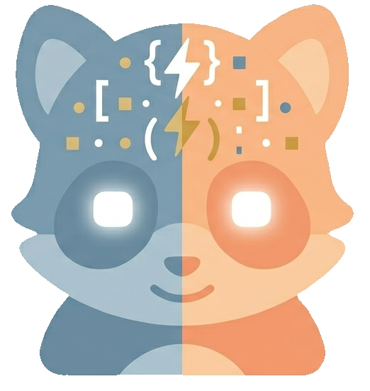

<p align="center">
  
</p>

<h1 align="center">Vyb</h1>

<p align="center">
  A desktop app for running and monitoring multiple AI agent terminal sessions in one unified interface.
</p>

<p align="center">
  
  
  
  
  
  
</p>

---

## Overview

Vyb lets you manage multiple AI coding agents — Claude Code, Codex, Gemini, OpenCode, or any terminal-based tool — from a single window. Each agent runs in its own embedded terminal with live status detection, so you always know which agents are working, waiting for input, or ready for the next task.

## Download

Pre-built installers for macOS, Windows, and Linux are available on the [Releases page](https://github.com/FreHilm/vyb/releases). The macOS build is signed and notarized — it opens normally without a Gatekeeper warning. Windows users will see a SmartScreen prompt (the app isn't EV-signed yet); pick "More info → Run anyway".

Vyb auto-updates from GitHub Releases on macOS once installed — you'll get an "Update ready" prompt the next time a new version ships.

### Key Features

- **Multi-agent terminals** — Run any number of AI agents, each in a full xterm.js terminal with WebGL-accelerated rendering. WebGL contexts are managed automatically (only active on visible terminals) to avoid hitting browser limits.
- **Splittable shell terminals** — Toggle a split-pane shell area beneath any agent, split into multiple side-by-side terminals with resizable dividers. Add with `Ctrl+Cmd+=`, close with `Ctrl+Cmd+-`.
- **Live status detection** — Per-agent adapters classify terminal output as *ready*, *working*, *needs input*, or *offline*. Animated flame indicators show status on every profile; OS notifications fire on completion or when input is needed.
- **Parallel agents** — Spawn worktree-isolated agents from a Kanban board (Ordna integration). Each parallel agent runs on its own git branch with auto-push and auto-cleanup.
- **Profile management** — Save named profiles with custom commands, working directories, icons, and status patterns. Organize into collapsible folders with drag-and-drop reordering. A locate-or-delete prompt fires automatically if a profile's directory is moved.
- **File explorer with git diff view** — Built-in file browser with CodeMirror 6 editor. Toggle "show only changed files" to filter the tree to files with git changes, and the editor renders modified files with an inline diff (red removals + green additions, plus scrollbar tick marks).
- **In-app web browser** — Embedded browser per profile with persistent cookies/sessions, back/forward/reload, right-click context menu, and detachable DevTools for the open page.
- **Git changes panel** — Side-by-side stage / unstage / commit workflow with branch & tree views, plus the persistent git status bar (branch, staged/modified/untracked, ahead/behind, stash count, last commit, clickable remote link).
- **Kanban integration** — Ordna lives as a profile-scoped tab (web or TUI). Tasks dispatched from Kanban arrive in the active agent's terminal with a contextual prompt.
- **Keyboard navigation** — Hold a modifier key (Cmd or Alt, configurable) to reveal numbered shortcuts over command bar buttons, arrow indicators for profile cycling and pane cycling.
- **README viewer** — Renders any project's README.md with full GitHub Flavored Markdown, including Mermaid diagrams.
- **AI-generated icons** — Generate unique profile icons using Gemini or OpenAI, with optional style reference images for consistency. Batch-generate for all profiles at once.
- **Customizable theme** — Adjust hue (full color wheel + grayscale), darkness, and text brightness. Separate font sizes for sidebar, agent terminals, and shell terminals. Catppuccin-inspired palette throughout.
- **Configurable quick launchers** — Add custom external app buttons (VS Code, Fork, iTerm, etc.) with selectable icons and shell commands using `{path}` placeholder.
- **Dictation** — Voice input via Ctrl+Shift+D using OpenAI Whisper or Gemini for transcription. Toggle or hold-to-record modes with configurable language.
- **Auto-updates** — Signed macOS builds check GitHub Releases on launch and prompt to install when a new version is available.
- **Backup & restore** — Export/import all settings, profiles, layout, and icons as a ZIP file.
- **Resizable panes** — Drag handles between sidebar/main area, agent/shell terminals, and tree/editor. Sizes persist across sessions per profile.

## Building from Source

Most users should grab a [pre-built release](https://github.com/FreHilm/vyb/releases). The steps below are for development or platform builds Vyb doesn't ship yet.

### Prerequisites

- **Node.js** 24+ LTS (recommended via `nvm use 24`)
- **npm** 11+
- A terminal-based AI agent on `PATH` (e.g. `claude`, `codex`, `gemini`, `opencode`) — optional; the app works with any command you point a profile at

### Setup

```bash
git clone https://github.com/FreHilm/vyb.git
cd vyb
npm install
```

### Development

```bash
npm start
```

Launches the app in development mode with hot reload via Electron Forge + Vite. The native module `node-pty` is rebuilt automatically.

### Build & Package

```bash
npm run package    # Package the app for the current platform (no installer)
npm run make       # Build distributables: DMG + ZIP on macOS, exe installer on Windows, deb/rpm on Linux
npm run publish    # Build + upload artifacts to a GitHub Release (requires GITHUB_TOKEN + Apple signing env vars on macOS)
npm run lint       # Run ESLint across all .ts/.tsx files
```

Release builds run automatically via GitHub Actions when you push a `v*.*.*` tag — see `.github/workflows/release.yml`.

## Configuration

### Profiles

Profiles are stored in `{userData}/profiles.json`. Each profile defines an agent session:

```json
{
  "id": "claude-default",
  "name": "Claude Code",
  "icon": "",
  "workingDirectory": "~/projects/my-app",
  "command": "claude",
  "args": ["--continue"],
  "statusPatterns": {
    "ready": ["for\\s*shortcuts", "\\$\\s*$"],
    "needsInput": ["\\(y\\/n\\)", "Allow\\s*once", "Yes.*No.*Always"]
  }
}
```

| Field | Description |
|-------|-------------|
| `id` | Unique identifier (auto-generated slug) |
| `name` | Display name shown in the sidebar |
| `icon` | Path to a custom icon image (or empty for generated avatar) |
| `workingDirectory` | Starting directory for the terminal (`~` is expanded automatically) |
| `command` | The command to run (e.g., `claude`, `aider`, `bash`) |
| `args` | Array of command-line arguments (default: `["--continue"]`) |
| `statusPatterns.ready` | Regex patterns that indicate the agent is idle/ready |
| `statusPatterns.needsInput` | Regex patterns that indicate the agent is waiting for user input |

Profiles are fully editable through the in-app profile editor — no need to edit JSON by hand.

### Settings

All settings are accessible via the settings dialog (`Cmd+,` on macOS, `Ctrl+,` on Windows/Linux), organized into tabs:

#### Appearance

| Setting | Description | Default |
|---------|-------------|---------|
| Base Hue | UI color hue (0-359), or 360 for grayscale | 240 |
| Darkness | How dark the UI background is (0-80) | 0 |
| Text Lightness | UI text brightness (0=white, 100=black) | 12 |
| Profile Font Size | Sidebar text size (10-20px) | 13 |
| Agent Font Size | Agent terminal text size (10-24px) | 14 |
| Shell Font Size | Shell terminal text size (10-24px) | 14 |
| Quick Nav Key | Modifier for keyboard shortcuts (Cmd or Alt) | Cmd |

#### Flames

| Setting | Description | Default |
|---------|-------------|---------|
| Intensity | Brightness/opacity of the flame indicators | 50 |
| Spread | How wide the flame spikes extend horizontally | 50 |
| Length | Width of the flame zone along the profile edge | 50 |
| Speed | Animation pace (slow breathing to rapid flicker) | 50 |

#### Icons

| Setting | Description | Default |
|---------|-------------|---------|
| Provider | AI image generation service (Gemini or ChatGPT) | Gemini |
| Model | Specific model (Nano Banana 2/Pro, GPT Image 1, DALL-E 3, etc.) | Nano Banana 2 |
| Prompt | Style description for generated icons | Flat icon style |
| Reference Image | Optional image for visual style consistency | — |
| Batch Generate | Generate icons for all profiles without one | — |

#### Apps

Configure external app launchers. Each app has a name, icon (from built-in set: VS Code, Code, Terminal, Git Branch, Folder, Globe, Rocket, etc.), and a shell command with `{path}` placeholder.

#### Integrations

| Setting | Description |
|---------|-------------|
| OpenAI API Key | For icon generation (GPT Image) and dictation (Whisper) |
| Gemini API Key | For icon generation (Nano Banana) and dictation fallback |

#### Backup

Export/import all configuration (profiles, settings, layout, icons) as a ZIP file.

### Keyboard Shortcuts

Hold the configured modifier key (default: Cmd) to reveal navigation hints:

| Shortcut | Action |
|----------|--------|
| Mod + 1-9, 0 | Activate command bar buttons (README, Files, Terminal, Folder, apps...) |
| Mod + ↑ / ↓ | Navigate between profiles |
| Mod + ← / → | Cycle between agent pane and shell terminals |
| Ctrl + Cmd + = | Add a new shell terminal split |
| Ctrl + Cmd + - | Close the last shell terminal |
| Ctrl + Shift + D | Toggle dictation |
| Cmd + , | Open Settings |

## Architecture

The app follows Electron's recommended security model with strict context isolation:

```
┌──────────────────────────────────────────────────────┐
│  Main Process (src/main.ts, src/main/)               │
│  ├── PtyManager        — spawns/manages PTY instances│
│  ├── StatusDetector    — main-thread wrapper around… │
│  ├── status-worker.ts  — worker thread: ANSI strip + │
│  │                       per-agent status adapters   │
│  ├── ipc-handlers.ts   — IPC + profile/settings io   │
│  ├── ordna-manager.ts  — Kanban (Ordna) lifecycle    │
│  └── auto-update.ts    — electron-updater wiring     │
├──────────────────────────────────────────────────────┤
│  Preload (src/preload.ts)                            │
│  └── contextBridge → exposes window.api              │
├──────────────────────────────────────────────────────┤
│  Renderer (src/renderer/, React 19)                  │
│  ├── App.tsx           — root state & routing        │
│  ├── Sidebar           — profiles, folders, drag-drop│
│  ├── TerminalPane      — agent terminals (xterm.js)  │
│  ├── ShellPane         — splittable shell terminals  │
│  ├── CommandBar        — quick-action buttons + nav  │
│  ├── FileExplorer      — tree + CodeMirror + diff    │
│  ├── ReadmeViewer      — markdown display            │
│  ├── WebViewer         — embedded browser + DevTools │
│  ├── GitChangesPanel   — stage/commit + tree views   │
│  ├── KanbanViewer      — Ordna integration           │
│  ├── StatusBar         — git status & remote link    │
│  ├── SettingsDialog    — tabbed settings             │
│  ├── ProfileEditor     — profile CRUD + icon gen     │
│  └── KeyNav            — keyboard navigation system  │
└──────────────────────────────────────────────────────┘
```

## Tech Stack

| Layer | Technology |
|-------|-----------|
| Framework | Electron 42 |
| UI | React 19, TypeScript 5.8 |
| Bundler | Vite 5 + Electron Forge 7 |
| Terminal | xterm.js 6 + WebGL + node-pty |
| Editor | CodeMirror 6 (one-dark theme), `@codemirror/merge` for inline diff |
| Markdown | react-markdown + remark-gfm + Mermaid |
| Packaging | Squirrel (Windows), DMG + ZIP (macOS), DEB/RPM (Linux) |
| Auto-update | electron-updater (GitHub Releases) |

## Platform Support

| Platform | Format | Notes |
|----------|--------|-------|
| macOS | `.dmg`, `.zip` | Signed + notarized (Apple Developer ID), native title bar (`hiddenInset`), Dock integration, auto-updates |
| Windows | Squirrel installer (`.exe`) | Custom title bar overlay. Not yet EV-signed — SmartScreen warning on first launch |
| Linux | `.deb`, `.rpm` | Custom title bar overlay |

## License

MIT -- see [LICENSE](LICENSE).

Third-party dependency licenses: [THIRD_PARTY_NOTICES.md](THIRD_PARTY_NOTICES.md).
